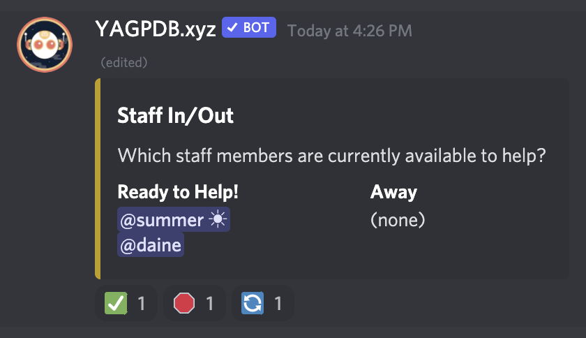

# Availability

## What is it?

A cute little embed that allows staff to mark whether they're available or away using reactions.

## How do I use it?

Requires the [YAGPDB Discord bot](https://yagpdb.xyz).

To set up the embed, type `y!availabilityEmbed` where `y!` is the prefix for YAGPDB.

The first two emojis add the person who uses them to the available or away list. The last emoji resets the embed to its initial state.
